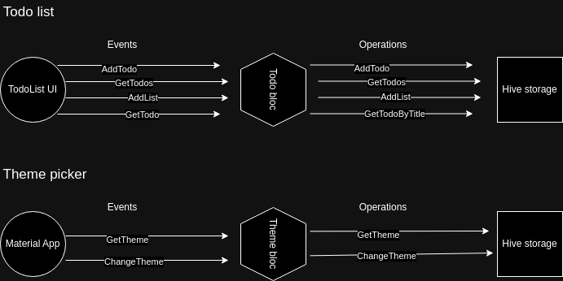

# todolist

Simple todolist app made by using bloc pattern..

## Getting Started

A Bloc is a more advanced class which relies on `events` to trigger `state` changes rather than functions. Bloc also extends `BlocBase` which means it has a similar public API as `Cubit`. However, rather than calling a function on a `Bloc` and directly emitting a new `state`, `Blocs` receive `events` and convert the incoming `events` into outgoing `states`.


[source: pub.dev/packages/bloc](https://pub.dev/packages/bloc)

In this project I implemeted BloC pattern for the todo list and theme picker like this:



## Libraries used

| library | version | 
| ------- | ------- | 
| [flutter_bloc](https://pub.dev/packages/flutter_bloc) | 8.1.3 | 
| [equatable](https://pub.dev/packages/equatable)     | 2.0.5 |
| [hive](https://pub.dev/packages/hive) | 2.2.3 |
| [hive_flutter](https://pub.dev/packages/hive_flutter) | 1.1.0 |
| [build_runner](https://pub.dev/packages/build_runner) | 2.4.6 |

## Usage

You can download and install the app from the [release](https://github.com/Besufikad17/todolist/releases/) section. If you want to clone the project and play with it check the following steps.

```bash
    git clone https://github.com/Besufikad17/todolist.git && 
    cd todolist && 
    flutter pub get && 
    flutter run
```

